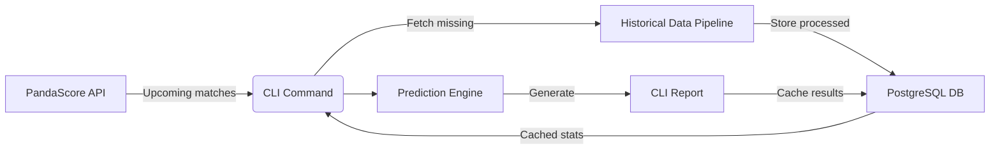
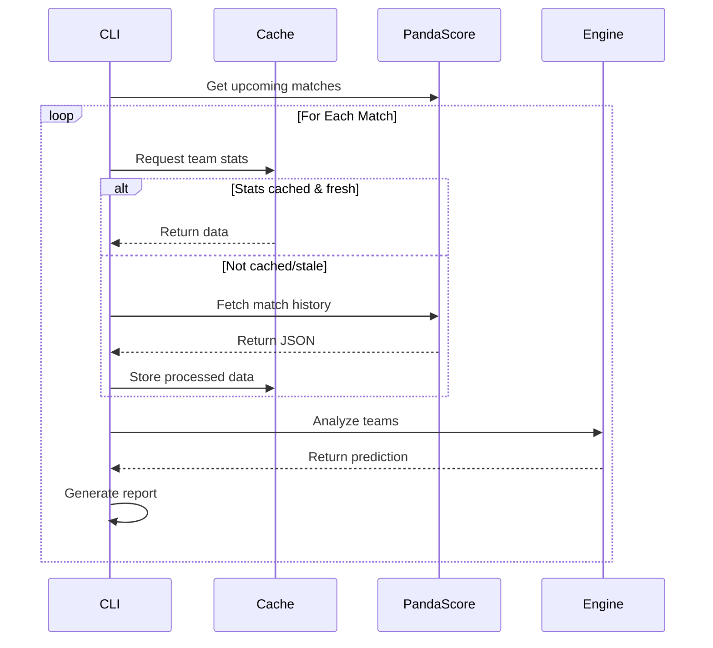

# Esports Analytics

[]()
[]()
[]()

AI-powered match prediction engine for competitive esports. Analyzes team performance, 
historical data, and fatigue factors to generate winning probabilities.

## Features
- Multi-game support (CS:GO, Dota 2, Valorant)
- Team performance analytics (form, H2H, fatigue)
- Prediction engine with confidence scoring
- Rich CLI interface
- Automated data synchronization
- Caching for rapid predictions

## Prediction Model
| Factor         | Weight | Calculation Method               |
|----------------|--------|----------------------------------|
| Team Form      | 40%    | Win rate (last 5 matches)        |
| H2H History    | 30%    | Historical win % vs opponent     |
| Fatigue        | 30%    | Days since last match            |

## Getting Started

### Prerequisites
- Python 3.10+
- PostgreSQL
- [PandaScore API Key](https://pandascore.co/)

### Installation
```bash
git clone https://github.com/yourusername/esports-analytics.git
cd esports-analytics

# Create virtual environment
python -m venv venv
source venv/bin/activate  # Linux/Mac
venv\Scripts\activate     # Windows

# Install dependencies
pip install -r requirements.txt

# Configure environment
cp .env.example .env
# Edit .env with your credentials
```

### Database Setup
```bash
python manage.py migrate
python manage.py createsuperuser
```
### Running Predictions
```bash
# Fetch live matches
python manage.py fetch_matches --game=csgo

# Run predictions
python manage.py predict_match
```
## System Architecture
### Data Flow

### Prediction Workflow

## Sample Output

| Teams          | Winner | Confidence | Details                      |
|----------------|--------|------------|------------------------------|
| Fnatic vs NAVI | NAVI   | 78.2%      | Form: 60% vs 80%             |
|                |        |            | H2H: 45% • Fatigue: +2d      |

## Contributing
Contributions are welcome. Please refer to the CONTRIBUTING.md file for guidelines.

## License
This project is licensed under the MIT License - see LICENSE.md for details.
