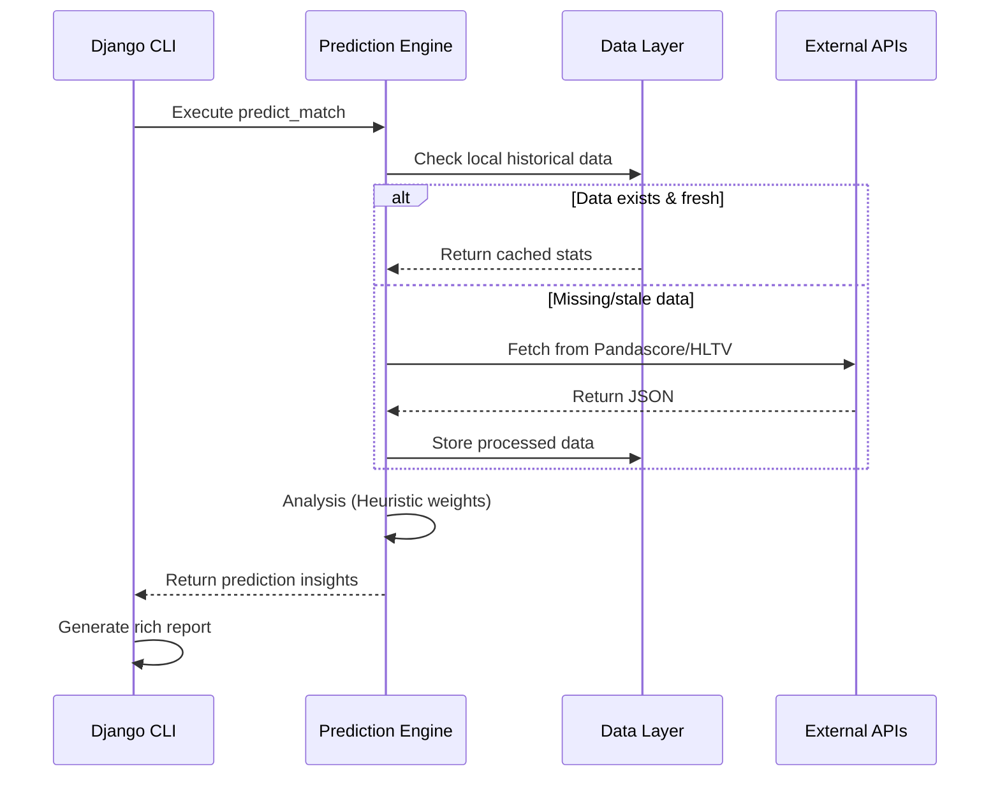
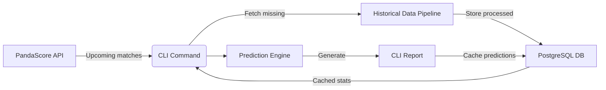

# Esports Analytics MVP Scope

## Core Features
- **Multi-game support**: CS:GO, Dota 2, Valorant
- **Team performance analysis**: 
  - Form (last 10 matches)
  - Head-to-head (H2H) history
  - Fatigue metrics
- **Match prediction**: Confidence scoring system
- **CLI interface**: Rich-formatted predictions
- **Automated data updates**: Scheduled PandaScore sync

## 🛠 Technical Stack
- **Language**: Python 3.10+
- **Framework**: Django 4.2+
- **Database**: PostgreSQL 14+
- **APIs**: 
  - Primary: [PandaScore](https://pandascore.co/)
  - Secondary: HLTV (sentiment analysis)
- **Key Libraries**:
  - Rich (CLI formatting)
  - Requests (API communication)
  - Tenacity (retry logic)

## Prediction Model
| Factor         | Weight | Data Source                          | Calculation Method                     |
|----------------|--------|--------------------------------------|----------------------------------------|
| Team Form      | 40%    | Last 10 matches                       | Win rate (wins/total)                  |
| H2H History    | 30%    | Historical vs opponent               | Win rate against specific opponent     |
| Fatigue        | 30%    | Match timestamps                     | Days since last match (normalized 0-1) |

## Excluded from MVP
- Player-level statistics
- Real-time in-match updates
- Betting odds integration
- Machine learning model training
- Mobile/Web interface

## Future Roadmap
- Player performance metrics
- HLTV sentiment analysis
- Twitter/X team mood monitoring
- Telegram/Discord bot interface
- Live match win probability

## Development Timeline
| Day | Focus                     | Deliverable                          | Status     |
|-----|---------------------------|--------------------------------------|------------|
| 1   | Data Model Expansion      | TeamAnalysis model + migrations      | Completed  |
| 2   | Historical Pipeline       | fetch_team_history() utility         | In Progress|
| 3   | Prediction Algorithm      | Weighted scoring engine              | Planned    |
| 4   | CLI Integration           | predict_match command                | Planned    |
| 5   | Sentiment (Stretch)       | HLTV scraper                         | Planned    |
| 6   | Testing                   | Mock data + validation tests         | Planned    |
| 7   | Polishing                 | Readme + demo recording              | Planned    |

## System Architecture

## Data Flow

